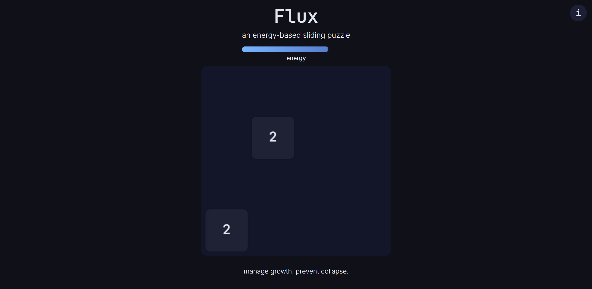

# Flux
A 4x4 energy-based sliding puzzle

## How to Play
- Use the **arrow keys** to slide tiles.
- **Merge tiles** with the same value to grow them.
- **Moves cost energy**, merges restore energy (+2 per merge).
- **Goal:** grow tiles without running out of energy.
- Game ends when **energy reaches 0**.

## Credits
- Made with **HTML**, **CSS**, and **JavaScript**
- Fonts: **JetBrains Mono** & **Inter**